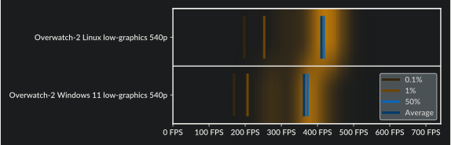

# MangoHud

A Vulkan and OpenGL overlay for monitoring FPS, temperatures, CPU/GPU load and more.


---

- [MangoHud](#mangohud)
  - [Installation - Build From Source](#installation---build-from-source)
    - [Dependencies](#dependencies)
    - [Building with build script](#building-with-build-script)
  - [Installation - Pre-packaged Binaries](#installation---pre-packaged-binaries)
    - [GitHub releases](#github-releases)
    - [Arch-based distributions](#arch-based-distributions)
    - [Debian, Ubuntu](#debian-ubuntu)
    - [Fedora](#fedora)
    - [Solus](#solus)
    - [openSUSE](#opensuse)
    - [Flatpak](#flatpak)
  - [Normal usage](#normal-usage)
  - [OpenGL](#opengl)
  - [Hud configuration](#hud-configuration)
    - [Environment Variables: **`MANGOHUD_CONFIG`**, **`MANGOHUD_CONFIGFILE`**, and **`MANGOHUD_PRESETSFILE`**](#environment-variables)
  - [Vsync](#vsync)
    - [OpenGL Vsync](#opengl-vsync)
    - [Vulkan Vsync](#vulkan-vsync)
  - [Keybindings](#keybindings)
  - [Workarounds](#workarounds)
  - [FPS logging](#fps-logging)
    - [Online visualization: FlightlessMango.com](#online-visualization-flightlessmangocom)
    - [Local visualization: `mangoplot`](#local-visualization-mangoplot)

## Installation - Build From Source

---

If you wish to compile MangoHud to keep up to date with any changes - first clone this repository and cd into it:

```
git clone --recurse-submodules https://github.com/flightlessmango/MangoHud.git
cd MangoHud
```

Using `meson` to install "manually":

```
meson build
ninja -C build install
```

By default, meson should install MangoHud to `/usr/local`. Specify install prefix with `--prefix=/usr` if desired.
Add `-Dappend_libdir_mangohud=false` option to meson to not append `mangohud` to libdir if desired (e.g. /usr/local/lib/mangohud).

To install 32-bit build on 64-bit distro, specify proper `libdir`: `lib32` for Arch, `lib/i386-linux-gnu` on Debian-based distros. RPM-based distros usually install 32-bit libraries to `/usr/lib` and 64-bit to `/usr/lib64`.
You may have to change `PKG_CONFIG_PATH` to point to correct folders for your distro.

```
CC="gcc -m32" \
CXX="g++ -m32" \
PKG_CONFIG_PATH="/usr/lib32/pkgconfig:/usr/lib/i386-linux-gnu/pkgconfig:/usr/lib/pkgconfig" \
meson build32 --libdir lib32
ninja -C build32 install
```

### Dependencies

Install necessary development packages.

- gcc, g++
- or gcc-multilib, g++-multilib for 32-bit support
- meson >=0.54
- ninja (ninja-build)
- glslang
- libGL/libEGL (libglvnd, mesa-common-dev, mesa-libGL-devel etc)
- X11 (libx11-dev)
- XNVCtrl (libxnvctrl-dev), optional, use `-Dwith_xnvctrl=disabled` option with `meson` to disable
- D-Bus (libdbus-1-dev), optional, use `-Dwith_dbus=disabled` option with `meson` to disable
- wayland-client
- xcbcommon

Python 3 libraries:

- Mako (python3-mako or install with `pip`)

If distro's packaged `meson` is too old and gives build errors, install newer version with `pip` (`python3-pip`).

### Building with build script

You can also use `build.sh` script to do some things automatically like install dependencies, if distro is supported but it usually assumes you are running on x86_64 architecture.

To just build it, execute:

```
./build.sh build
```

You can also pass arguments to meson:

```
./build.sh build -Dwith_xnvctrl=disabled
```

Resulting files will be install to `./build/release` folder.

If you have compiled MangoHud from source, to install it, execute:

```
./build.sh install
```

You can then subsequently uninstall MangoHud via the following command

```
./build.sh uninstall
```

To tar up the resulting binaries into a package and create a release tar with installer script, execute:

```
./build.sh package release
```

or combine the commands, although `package` should also call `build` if it doesn't find the built libs:

```
./build.sh build package release
```

If you have built MangoHud before and suddenly it fails, you can try cleaning the `build` folder, execute:

```
./build.sh clean
```

Currently it just does `rm -fr build` and clears subprojects.

__NOTE: If you are running an Ubuntu-based, Arch-based, Fedora-based, or openSUSE-based distro, the build script will automatically detect and prompt you to install missing build dependencies. If you run into any issues with this please report them!__

## Installation - Pre-packaged Binaries

---

### GitHub releases

If you do not wish to compile anything, simply download the file under [Releases](https://github.com/flightlessmango/MangoHud/releases), extract it, and from within the extracted folder in terminal, execute:

```
./mangohud-setup.sh install
```

### Arch-based distributions

If you are using an Arch-based distribution, install [`mangohud`](https://archlinux.org/packages/extra/x86_64/mangohud/) and [`lib32-mangohud`](https://archlinux.org/packages/multilib/x86_64/lib32-mangohud/) from the `extra`/`multilib` repository. [`mangohud-git`](https://aur.archlinux.org/packages/mangohud-git/) and [`lib32-mangohud-git`](https://aur.archlinux.org/packages/lib32-mangohud-git/) are available on the AUR to be installed via your favourite AUR helper. These can help fix issues with the hud not activating when using stable releases from pacman!

If you are building it by yourself, you need to enable multilib repository, by editing pacman config:

```
sudo nano /etc/pacman.conf
```

and uncomment:

```txt
#[multilib]
#Include = /etc/pacman.d/mirrorlist
```

then save the file and execute:

```
sudo pacman -Syy
```

### Debian, Ubuntu

If you are using Debian 11 (Bullseye) or later, Ubuntu 21.10 (Impish) or later, or distro derived from them, to install the [MangoHud](https://tracker.debian.org/pkg/mangohud) package, execute:

```
sudo apt install mangohud
```

Optionally, if you also need MangoHud for 32-bit applications, execute:

```
sudo apt install mangohud:i386
```

### Fedora

If you are using Fedora, to install the [MangoHud](https://src.fedoraproject.org/rpms/mangohud) package, execute:

```
sudo dnf install mangohud
```

### Solus

If you are using Solus, to install [MangoHud](https://dev.getsol.us/source/mangohud/) simply execute:

```
sudo eopkg it mangohud
```

### openSUSE

If you run openSUSE Leap or Tumbleweed you can get Mangohud from the official repositories.
There are two packages, [mangohud](https://software.opensuse.org/package/mangohud) for 64bit and [mangohud-32bit](https://software.opensuse.org/package/mangohud-32bit) for 32bit application support.
To have Mangohud working for both 32bit and 64bit applications you need to install both packages even on a 64bit operating system.

```
sudo zypper in mangohud mangohud-32bit
```

Leap doesn't seem to have the 32bit package.

Leap 15.2

```
sudo zypper addrepo -f https://download.opensuse.org/repositories/games:tools/openSUSE_Leap_15.2/games:tools.repo
sudo zypper install mangohud
```

Leap 15.3

```
sudo zypper addrepo -f https://download.opensuse.org/repositories/games:tools/openSUSE_Leap_15.3/games:tools.repo
sudo zypper install mangohud
```

### Flatpak

If you are using Flatpaks, you will have to add the [Flathub repository](https://flatpak.org/setup/) for your specific distribution, and then, to install it, execute:

For flatpak:

```
flatpak install org.freedesktop.Platform.VulkanLayer.MangoHud
```

To enable MangoHud for all Steam games:

```
flatpak override --user --env=MANGOHUD=1 com.valvesoftware.Steam
```

## Normal usage

---

To enable the MangoHud overlay layer for Vulkan and OpenGL, run :

`mangohud /path/to/app`

For Lutris games, go to the System options in Lutris (make sure that advanced options are enabled) and add this to the `Command prefix` setting:

`mangohud`

For Steam games, you can add this as a launch option:

`mangohud %command%`

Or alternatively, add `MANGOHUD=1` to your shell profile (Vulkan only).

## OpenGL

OpenGL games may also need `dlsym` hooking. Add `--dlsym` to your command like `mangohud --dlsym %command%` for Steam.

Some Linux native OpenGL games overrides LD_PRELOAD and stops MangoHud from working. You can sometimes fix this by editing LD_PRELOAD in the start script
`LD_PRELOAD=/path/to/mangohud/lib/`

## gamescope

To enable mangohud with gamescope you need to install mangoapp.
`gamescope --mangoapp %command%`

Using normal mangohud with gamescope is not support.

## Hud configuration

MangoHud comes with a config file which can be used to set configuration options globally or per application. Usually it is installed as `/usr/share/doc/mangohud/MangoHud.conf.example` or [get a copy from here](https://raw.githubusercontent.com/flightlessmango/MangoHud/master/data/MangoHud.conf).

The priorities of different config files are:

1. `/path/to/application/dir/MangoHud.conf`
2. Per-application configuration in ~/.config/MangoHud:
    1. `~/.config/MangoHud/<application_name>.conf` for native applications, where `<application_name>` is the case sensitive name of the executable
    2. `~/.config/MangoHud/wine-<application_name>.conf` for wine/proton apps, where `<application_name>` is the case sensitive name of the executable without the `.exe` ending
3. `~/.config/MangoHud/MangoHud.conf`

Example: For Overwatch, this would be `wine-Overwatch.conf` (even though the executable you run from Lutris is `Battle.net.exe`, the actual game executable name is `Overwatch.exe`).

If you start the game from the terminal with MangoHud enabled (for example by starting Lutris from the terminal), MangoHud will print the config file names it is looking for.

You can find an example config in /usr/share/doc/mangohud

[GOverlay](https://github.com/benjamimgois/goverlay) is a GUI application that can be used to manage the config

---

### Environment Variables

You can also customize the hud by using the `MANGOHUD_CONFIG` environment variable while separating different options with a comma. This takes priority over any config file.

You can also specify configuration file with `MANGOHUD_CONFIGFILE=/path/to/config` for applications whose names are hard to guess (java, python etc).

You can also specify presets file with `MANGOHUD_PRESETSFILE=/path/to/config`. This is especially useful when running mangohud in a sandbox such as flatpak.

A partial list of parameters are below. See the config file for a complete list.
Parameters that are enabled by default have to be explicitly disabled. These (currently) are `fps`, `frame_timing`, `cpu_stats` (cpu load), `gpu_stats` (gpu load), and each can be disabled by setting the corresponding variable to 0 (e.g., fps=0).

| Variable                           | Description                                                                           |
|------------------------------------|---------------------------------------------------------------------------------------|
| `af`                               | Anisotropic filtering level. Improves sharpness of textures viewed at an angle `0`-`16` |
| `alpha`                            | Set the opacity of all text and frametime graph `0.0`-`1.0`                           |
| `arch`                             | Show if the application is 32- or 64-bit                                              |
| `autostart_log=`                   | Starts the log after X seconds from mangohud init                                     |
| `background_alpha`                 | Set the opacity of the background `0.0`-`1.0`                                         |
| `battery_color`                    | Change the battery text color                                                         |
| `battery_icon`                     | Display battery icon instead of percent                                               |
| `battery_watt`                     | Display wattage for the battery option                                                |
| `battery_time`                     | Display remaining time for battery option                                             |
| `battery`                          | Display current battery percent and energy consumption                                |
| `benchmark_percentiles`            | Configure which framerate percentiles are shown in the logging summary. Default is `97,AVG,1,0.1` |
| `bicubic`                          | Force bicubic filtering                                                               |
| `blacklist`                        | Add a program to the blacklist. e.g `blacklist=vkcube,WatchDogs2.exe`                 |
| `cellpadding_y`                    | Set the vertical cellpadding, default is `-0.085` |
| `control=`                         | Sets up a unix socket with a specific name that can be connected to with mangohud-control.<br>I.e. `control=mangohud` or `control=mangohud-%p` (`%p` will be replaced by process id)    |
| `core_load_change`                 | Change the colors of cpu core loads, uses the same data from `cpu_load_value` and `cpu_load_change` |
| `core_load`                        | Display load & frequency per core                                                     |
| `core_bars`                        | Change the display of `core_load` from numbers to vertical bars                       |
| `cpu_load_change`                  | Change the color of the CPU load depending on load                                    |
| `cpu_load_color`                   | Set the colors for the gpu load change low, medium and high. e.g `cpu_load_color=0000FF,00FFFF,FF00FF` |
| `cpu_load_value`                   | Set the values for medium and high load e.g `cpu_load_value=50,90`                    |
| `cpu_mhz`                          | Show the CPUs current MHz                                                             |
| `cpu_power`<br>`gpu_power`         | Display CPU/GPU draw in watts                                                         |
| `cpu_temp`<br>`gpu_temp`<br>`gpu_junction_temp`<br>`gpu_mem_temp`           | Display current CPU/GPU temperature                                                  |
| `cpu_text`<br>`gpu_text`           | Override CPU and GPU text                                                             |
| `custom_text_center`               | Display a custom text centered useful for a header e.g `custom_text_center=FlightLessMango Benchmarks` |
| `custom_text`                      | Display a custom text e.g `custom_text=Fsync enabled`                                 |
| `debug`                            | Shows the graph of gamescope app frametimes and latency (only on gamescope obviously) |
| `device_battery_icon`              | Display wirless device battery icon.                                                  |
| `device_battery`                   | Display wireless device battery percent. Currently supported arguments `gamepad` and `mouse` e.g `device_battery=gamepad,mouse` |
| `dynamic_frame_timing`             | This changes frame_timing y-axis to correspond with the current maximum and minimum frametime instead of being a static 0-50 |
| `engine_short_names`               | Display a short version of the used engine (e.g. `OGL` instead of `OpenGL`)           |
| `engine_version`                   | Display OpenGL or vulkan and vulkan-based render engine's version                     |
| `exec`                             | Display output of bash command in next column, e.g `custom_text=/home` , `exec=df -h /home \| tail -n 1`. Only works with `legacy_layout=0` |
| `exec_name`                        | Display current exec name                                                             |
| `fan`                              | Shows the Steam Deck fan rpm                                                          |
| `fcat`                             | Enables frame capture analysis                                                        |
| `fcat_overlay_width=`              | Sets the width of fcat. Default is `24`                                               |
| `fcat_screen_edge=`                | Decides the edge fcat is displayed on. A value between `1` and `4`                    |
| `font_file_text`                   | Change text font. Otherwise `font_file` is used                                       |
| `font_file`                        | Change default font (set location to .TTF/.OTF file)                                  |
| `font_glyph_ranges`                | Specify extra font glyph ranges, comma separated: `korean`, `chinese`, `chinese_simplified`, `japanese`, `cyrillic`, `thai`, `vietnamese`, `latin_ext_a`, `latin_ext_b`. If you experience crashes or text is just squares, reduce font size or glyph ranges |
| `font_scale=`                      | Set global font scale. Default is `1.0`                                               |
| `font_scale_media_player`          | Change size of media player text relative to `font_size`                              |
| `font_size=`                       | Customizeable font size. Default is `24`                                              |
| `font_size_text=`                  | Customizeable font size for other text like media metadata. Default is `24`           |
| `fps_color_change`                 | Change the FPS text color depepending on the FPS value                                |
| `fps_color=`                       | Choose the colors that the fps changes to when `fps_color_change` is enabled. Corresponds with fps_value. Default is `b22222,fdfd09,39f900`   |
| `fps_limit_method`                 | If FPS limiter should wait before or after presenting a frame. Choose `late` (default) for the lowest latency or `early` for the smoothest frametimes |
| `fps_limit`                        | Limit the apps framerate. Comma-separated list of one or more FPS values. `0` means unlimited |
| `fps_only`                         | Show FPS only. ***Not meant to be used with other display params***                   |
| `fps_sampling_period=`             | Time interval between two sampling points for gathering the FPS in milliseconds. Default is `500`   |
| `fps_value`                        | Choose the break points where `fps_color_change` changes colors between. E.g `60,144`, default is `30,60` |
| `fps_metrics`                      | Takes a list of decimal values or the value avg, e.g `avg,0.001`                      |
| `frame_count`                      | Display frame count                                                                   |
| `frametime`                        | Display frametime next to FPS text                                                    |
| `fsr`                              | Display the status of FSR (only works in gamescope)                                   |
| `hdr`                              | Display the status of HDR (only works in gamescope)                                   |
| `refresh_rate`                     | Display the current refresh rate (only works in gamescope)                            |
| `full`                             | Enable most of the toggleable parameters (currently excludes `histogram`)             |
| `gamemode`                         | Show if GameMode is on                                                                |
| `gpu_color`<br>`cpu_color`<br>`vram_color`<br>`ram_color`<br>`io_color`<br>`engine_color`<br>`frametime_color`<br>`background_color`<br>`text_color`<br>`media_player_color`<br>`network_color`         | Change default colors: `gpu_color=RRGGBB` |
| `gpu_core_clock`<br>`gpu_mem_clock`| Display GPU core/memory frequency                                                     |
| `gpu_fan`                          | GPU fan in rpm on AMD, FAN in percent on NVIDIA |
| `gpu_load_change`                  | Change the color of the GPU load depending on load                                    |
| `gpu_load_color`                   | Set the colors for the gpu load change low,medium and high. e.g `gpu_load_color=0000FF,00FFFF,FF00FF` |
| `gpu_load_value`                   | Set the values for medium and high load e.g `gpu_load_value=50,90`                    |
| `gpu_name`                         | Display GPU name from pci.ids                                                         |
| `gpu_voltage`                      | Display GPU voltage (only works on AMD GPUs)                                          |
| `hide_fsr_sharpness`               | Hides the sharpness info for the `fsr` option (only available in gamescope)           |
| `histogram`                        | Change FPS graph to histogram                                                         |
| `horizontal`                       | Display Mangohud in a horizontal position                                             |
| `horizontal_stretch`               | Stretches the background to the screens width in `horizontal` mode                    |
| `hud_compact`                      | Display compact version of MangoHud                                                   |
| `hud_no_margin`                    | Remove margins around MangoHud                                                        |
| `io_read`<br> `io_write`           | Show non-cached IO read/write, in MiB/s                                               |
| `log_duration`                     | Set amount of time the logging will run for (in seconds)                              |
| `log_interval`                     | Change the default log interval in milliseconds. Default is `0`                       |
| `log_versioning`                   | Adds more headers and information such as versioning to the log. This format is not supported on flightlessmango.com (yet)    |
| `media_player_format`              | Format media player metadata. Add extra text etc. Semi-colon breaks to new line. Defaults to `{title};{artist};{album}` |
| `media_player_name`                | Force media player DBus service name without the `org.mpris.MediaPlayer2` part, like `spotify`, `vlc`, `audacious` or `cantata`. If none is set, MangoHud tries to switch between currently playing players |
| `media_player`                     | Show media player metadata                                                            |
| `no_display`                       | Hide the HUD by default                                                               |
| `no_small_font`                    | Use primary font size for smaller text like units                                     |
| `offset_x` `offset_y`              | HUD position offsets                                                                  |
| `output_file`                      | Set location and name of the log file                                                 |
| `output_folder`                    | Set location of the output files (Required for logging)                               |
| `pci_dev`                          | Select GPU device in multi-gpu setups                                                 |
| `permit_upload`                    | Allow uploading of logs to Flightlessmango.com                                        |
| `picmip`                           | Mip-map LoD bias. Negative values will increase texture sharpness (and aliasing). Positive values will increase texture blurriness `-16`-`16` |
| `position=`                        | Location of the HUD: `top-left` (default), `top-right`, `middle-left`, `middle-right`, `bottom-left`, `bottom-right`, `top-center`, `bottom-center` |
| `preset=`                          | Comma separated list of one or more presets. Default is `-1,0,1,2,3,4`. Available presets:<br>`0` (No Hud)<br> `1` (FPS Only)<br> `2` (Horizontal)<br> `3` (Extended)<br> `4` (Detailed)<br>User defined presets can be created by using a [presets.conf](data/presets.conf) file in `~/.config/MangoHud/`.                      |
| `procmem`<br>`procmem_shared`, `procmem_virt`| Displays process' memory usage: resident, shared and/or virtual. `procmem` (resident) also toggles others off if disabled |
| `ram`<br>`vram`                    | Display system RAM/VRAM usage                                                         |
| `read_cfg`                         | Add to MANGOHUD_CONFIG as first parameter to also load config file. Otherwise only `MANGOHUD_CONFIG` parameters are used |
| `reload_cfg=`                      | Change keybind for reloading the config. Default = `Shift_L+F4`                       |
| `resolution`                       | Display the current resolution                                                        |
| `retro`                            | Disable linear texture filtering. Makes textures look blocky                          |
| `round_corners`                    | Change the amount of roundness of the corners have e.g `round_corners=10.0`           |
| `show_fps_limit`                   | Display the current FPS limit                                                         |
| `swap`                             | Display swap space usage next to system RAM usage                                     |
| `table_columns`                    | Set the number of table columns for ImGui, defaults to 3                              |
| `temp_fahrenheit`                  | Show temperature in Fahrenheit                                                        |
| `text_outline`                     | Draw an outline around text for better readability. Enabled by default.               |
| `text_outline_color=`              | Set the color of `text_outline`. Default = `000000`                                   |
| `text_outline_thickness=`          | Set the thickness of `text_outline`. Default = `1.5`                                  |
| `throttling_status`                | Show if GPU is throttling based on Power, current, temp or "other" (Only shows if throttling is currently happening). Currently disabled by default for Nvidia as it causes lag on 3000 series |
| `throttling_status_graph`          | Same as `throttling_status` but displays throttling in the frametime graph and only power and temp throttling |
| `time`<br>`time_format=%T`         | Display local time. See [std::put_time](https://en.cppreference.com/w/cpp/io/manip/put_time) for formatting help. NOTE: Sometimes apps may set `TZ` (timezone) environment variable to UTC/GMT |
| `time_no_label`                    | Remove the label before time                                                          |
| `toggle_fps_limit`                 | Cycle between FPS limits (needs at least two values set with `fps_limit`). Defaults to `Shift_L+F1`                                    |
| `toggle_preset`                    | Cycle between Presets. Defaults to `Shift_R+F10`                                      |
| `toggle_hud=`<br>`toggle_logging=` | Modifiable toggle hotkeys. Default are `Shift_R+F12` and `Shift_L+F2`, respectively   |
| `toggle_hud_position`              | Toggle MangoHud postion. Default is `R_Shift+F11`                                     |
| `trilinear`                        | Force trilinear filtering                                                             |
| `upload_log`                       | Change keybind for uploading log                                                      |
| `upload_logs`                      | Enables automatic uploads of logs to flightlessmango.com                              |
| `version`                          | Show current MangoHud version                                                         |
| `vkbasalt`                         | Show if vkBasalt is on                                                                |
| `vsync`<br> `gl_vsync`             | Set Vsync for OpenGL or Vulkan                                                        |
| `vulkan_driver`                    | Display used Vulkan driver (radv/amdgpu-pro/amdvlk)                                   |
| `width=`<br>`height=`              | Customizeable HUD dimensions (in pixels)                                              |
| `wine_color`                       | Change color of the wine/proton text                                                  |
| `wine`                             | Show current Wine or Proton version in use                                            |
| `winesync`                         | Show wine sync method in use                                                          |
| `present_mode`                     | Shows current vulkan [present mode](https://registry.khronos.org/vulkan/specs/1.3-extensions/man/html/VkPresentModeKHR.html) or vsync status in opengl  |
| `network`                          | Show network interfaces tx and rx kb/s. You can specify interface with `network=eth0` |

Example: `MANGOHUD_CONFIG=cpu_temp,gpu_temp,position=top-right,height=500,font_size=32`
Because comma is also used as option delimiter and needs to be escaped for values with a backslash, you can use `+` like `MANGOHUD_CONFIG=fps_limit=60+30+0` instead.

*Note: Width and Height are set automatically based on the font_size, but can be overridden.*

*Note: RAPL is currently used for Intel CPUs to show power draw with `cpu_power` which may be unreadable for non-root users due to [vulnerability](https://platypusattack.com/). The corresponding `energy_uj` file has to be readable by corresponding user, e.g. by running `chmod o+r /sys/class/powercap/intel-rapl\:0/energy_uj` as root, else the power shown will be **0 W**, though having the file readable may potentially be a security vulnerability persisting until system reboots.*

*Note: The [zenpower3](https://git.exozy.me/a/zenpower3) or [zenergy](https://github.com/boukehaarsma23/zenergy) kernel driver must be installed to show the power draw of Ryzen CPUs.*

## Vsync

### OpenGL Vsync

- `-1` = Adaptive sync
- `0`  = Off
- `1`  = On
- `n`  = Sync to refresh rate / n.

### Vulkan Vsync

- `0` = Adaptive VSync (FIFO_RELAXED_KHR)
- `1` = Off (IMMEDIATE_KHR)
- `2` = Mailbox (VSync with uncapped FPS) (MAILBOX_KHR)
- `3` = On (FIFO_KHR)

Not all vulkan vsync options may be supported on your device, you can check what your device supports here [vulkan.gpuinfo.org](https://vulkan.gpuinfo.org/listsurfacepresentmodes.php?platform=linux)

## Keybindings

- `Shift_L+F2` : Toggle Logging
- `Shift_L+F4` : Reload Config
- `Shift_R+F12` : Toggle Hud

## Workarounds

Options starting with "gl_*" are for OpenGL.

- `gl_size_query = viewport` : Specify what to use for getting display size. Options are "viewport", "scissorbox" or disabled. Defaults to using glXQueryDrawable.
- `gl_bind_framebuffer = 0..N` : (Re)bind given framebuffer before MangoHud gets drawn. Helps with Crusader Kings III.
- `gl_dont_flip = 1` : Don't swap origin if using GL_UPPER_LEFT. Helps with Ryujinx.

## FPS logging

You must set a valid path for `output_folder` in your configuration to store logs in.

When you toggle logging (default keybind is `Shift_L+F2`), a file is created with the game name plus a date & timestamp in your `output_folder`.

Log files can be visualized with two different tools: online and locally.

### Online visualization: FlightlessMango.com
Log files can be (batch) uploaded to [FlightlessMango.com](https://flightlessmango.com/games/user_benchmarks), which will then take care of creating a frametime graph and a summary with 1% min / average framerate / 97th percentile in a table form and a horizontal bar chart form.

Notes:
- Uploaded benchmarks are public: you can share them with anyone by simply giving them the link.
- Benchmark filenames are used as legend in the produced tables and graphs, they can be renamed after the upload.


### Local visualization: `mangoplot`
`mangoplot` is a plotting script that is shipped with `MangoHud`: on a given folder, it takes each log file, makes a 1D heatmap of its framerates, then stacks the heats maps vertically to form a 2D graph for easy visual comparison between benchmarks.

Example output:



<sub><sup>Overwatch 2, 5950X + 5700XT, low graphics preset, FHD, 50% render scale</sup></sub>
